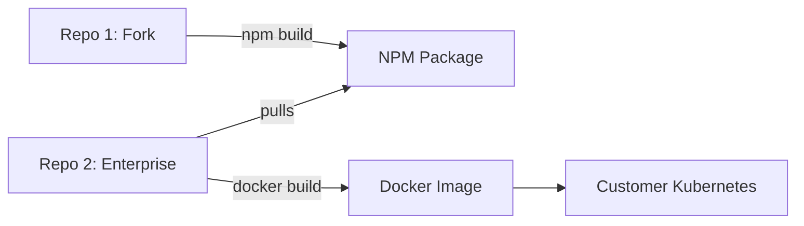

# Enterprise Repository Strategy

This document defines the **Repository Management Strategy** for delivering the Enterprise Edition of OpenClaw. We adhere to the **Strict Composition Model**.

## 1. The Architecture

We split the codebase into two distinct repositories to maintain a clean separation between "Open Source Core" and "Proprietary IP".

| Repository | `chockslam/openclaw` (Repo 1) | `chockslam/openclaw-enterprise` (Repo 2) |
| :--- | :--- | :--- |
| **Role** | The Engine (Dependencies) | The Product (Application) |
| **Type** | Maintained Fork | Proprietary Wrapper |
| **Visibility** | Public (or Internal Open) | Private (Strict) |
| **Content** | Core Logic, Hook Interfaces | DB Drivers, SSO Logic, Dashboard |
| **Artifact** | NPM Package (`@chockslam/core`) | Docker Image (`openclaw-enterprise`) |

## 2. Repo 1: The Core Fork (`chockslam/openclaw`)

**Objective**: Maintain a reliable runtime that can be extended, while keeping drift from upstream minimal.

### Management Rules
1.  **Minimal Surface Area**: Do not add business logic here. Only add **Hooks** and **Interfaces**.
    *   *Allowed*: Adding `onSessionStart(user)` hook in `server.ts`.
    *   *Forbidden*: Adding `checkLicenseKey()` logic.
2.  **Upstream Compatibility**: The `main` branch must track `openclaw/openclaw` main weekly.
    *   Remote `origin`: `https://github.com/chockslam/openclaw.git`
    *   Remote `upstream`: `https://github.com/openclaw/openclaw.git`
3.  **Release Cycle**: Versioned independently (e.g., `v1.2.0-chockslam.1`).

## 3. Repo 2: The Enterprise Product (`chockslam/openclaw-enterprise`)

**Objective**: Assemble the commercial product by injecting proprietary drivers into the Core.

### Management Rules
1.  **Dependency**: Depends on Repo 1 via `package.json`.
    ```json
    "dependencies": {
      "@chockslam/core": "git+ssh://git@github.com/chockslam/openclaw.git#v1.2.0"
    }
    ```
2.  **Logic Home**: All Enterprise features (SSO, Audit, SQL) live here.
3.  **UI Home**: The React Admin Dashboard lives here in `src/ui-admin`.

## 4. Workflows

### The "Sync" Workflow (Weekly)
Updates happen upstream constantly. We pull them in regularly to avoid massive conflicts.

```bash
# In Repo 1 (chockslam/openclaw)
git fetch upstream
git checkout main
git merge upstream/main
# Resolve conflicts (Keep our hooks!)
git push origin main
```

### The "Build" Workflow
How the final Docker image is built for customers.


